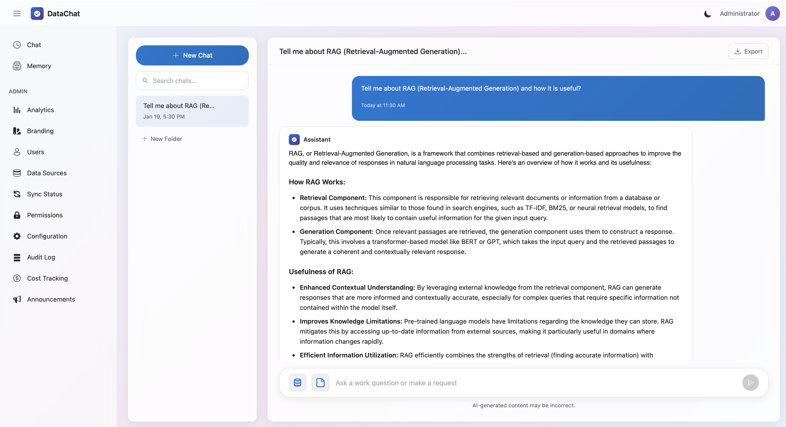

# DataChat

A modern enterprise AI chat application with RAG (Retrieval-Augmented Generation) capabilities. Chat with an AI that understands your documents and databases.


## Features

### Core Features
- **AI-Powered Chat** - Interactive chat interface with streaming responses powered by OpenAI, Azure OpenAI, or Ollama
- **RAG (Retrieval-Augmented Generation)** - AI responses grounded in your documents and data
- **File Uploads** - Upload images, PDFs, Excel files, CSV, and documents directly in chat for AI analysis
- **Multi-Provider LLM Support** - Choose between OpenAI, Azure OpenAI, or Ollama for chat and embeddings
- **SQL Data Sources** - Connect to SQL Server databases and query tables/views as knowledge sources
- **File System Indexing** - Index documents from folders with pattern matching
- **Vector Search** - SQL Server 2025 native VECTOR type for semantic search
- **User Management** - Role-based access control with local or Windows authentication
- **Data Source Permissions** - Control who can access which data sources
- **Personal Documents** - Users can upload private documents only they can search

### Chat Features
- **Message Reactions** - Thumbs up/down feedback on AI responses with optional comments
- **AI Memory** - Persistent memory that remembers user preferences and context across conversations
- **Dark Mode** - Full dark theme support with automatic persistence

### Admin Dashboard
- **Configuration Status** - Visual dashboard showing red/yellow/green status for all system components
- **Analytics Dashboard** - Usage metrics, daily activity charts, top users, and engagement statistics
- **Audit Log Viewer** - Searchable log of all system actions with filtering and export
- **Cost Tracking** - Monitor API token usage and costs with budget alerts
- **Announcement Banner** - Display system-wide announcements with scheduling and styling options
- **Branding Configuration** - Customize application name, colors, and logo
- **User Management** - Manage users, roles, and AD group mappings
- **Data Source Management** - Configure and monitor knowledge base sync status
- **Authentication Configuration** - Configure Local or Windows Authentication with domain restrictions

## Screenshots



## Technology Stack

| Category | Technologies |
|----------|-------------|
| **Backend** | .NET 8, ASP.NET Core, Entity Framework Core 8 |
| **Frontend** | Blazor Server, Microsoft Fluent UI |
| **Database** | SQL Server 2025 (native VECTOR support) |
| **AI** | OpenAI, Azure OpenAI, or Ollama (GPT-4o, GPT-4, Llama, etc.) |
| **Architecture** | Clean Architecture, CQRS with MediatR |
| **Real-time** | SignalR for streaming responses |

## Prerequisites

Before you begin, ensure you have the following installed:

- [.NET 8 SDK](https://dotnet.microsoft.com/download/dotnet/8.0)
- [SQL Server 2025](https://www.microsoft.com/en-us/sql-server/sql-server-downloads) (required for native VECTOR type)
- One of the following AI providers:
  - [OpenAI API Key](https://platform.openai.com/api-keys)
  - [Azure OpenAI Service](https://azure.microsoft.com/en-us/products/ai-services/openai-service)
  - [Ollama](https://ollama.ai/) (for local/self-hosted models)

## Installers (Windows & macOS)

If you just want to run DataChat locally, prebuilt installers are the fastest path — no .NET SDK required on the target machine. Each installer bundles a self-contained publish, registers DataChat as a background service (Windows Service / macOS LaunchAgent), and opens the first-run Setup Wizard in your browser.

| Platform | Artifact | Notes |
|----------|----------|-------|
| Windows 10/11 (x64) | `DataChat-Setup-<ver>-x64.exe` | Installs as a Windows Service; optional firewall rule for TCP 5159 |
| macOS 11+ (Apple Silicon & Intel) | `DataChat-Installer-<ver>.pkg` | Loads a LaunchAgent; launches at login |

**During install, you'll be asked about the database:**

- *Bundled local SQL Server 2025* — Windows: downloads & silently installs SQL Server 2025 Express. macOS: starts SQL Server 2025 in Docker (requires Docker Desktop).
- *Connect to existing SQL Server* — installer leaves the connection string blank; the Setup Wizard prompts you on first launch.

Builds are unsigned in this pass, so expect a SmartScreen "More info → Run anyway" (Windows) or right-click → Open (macOS) on first launch.

See [installer/README.md](installer/README.md) for how to build the installers from source (`build/publish.sh` + Inno Setup on Windows, `build-pkg.sh` on macOS).

## Quick Start

### 1. Clone the Repository

```bash
git clone https://github.com/Chrisrokc/DataChat.git
cd DataChat
```

### 2. Configure the Database Connection

**Option A: Environment Variable (Recommended for Production)**

Set the connection string via environment variable to avoid storing credentials in config files:

```bash
# Linux/macOS
export ConnectionStrings__DefaultConnection="Server=YOUR_SERVER;Database=DataChat;User Id=sa;Password=YOUR_PASSWORD;TrustServerCertificate=True;"

# Windows PowerShell
$env:ConnectionStrings__DefaultConnection="Server=YOUR_SERVER;Database=DataChat;User Id=sa;Password=YOUR_PASSWORD;TrustServerCertificate=True;"

# Windows Command Prompt
set ConnectionStrings__DefaultConnection=Server=YOUR_SERVER;Database=DataChat;User Id=sa;Password=YOUR_PASSWORD;TrustServerCertificate=True;
```

**Option B: appsettings.json (Development Only)**

For local development, you can edit `src/Presentation/DataChat.Web/appsettings.json`:

```json
{
  "ConnectionStrings": {
    "DefaultConnection": "Server=YOUR_SERVER;Database=DataChat;User Id=sa;Password=YOUR_PASSWORD;TrustServerCertificate=True;"
  }
}
```

> **Security Note:** Never commit credentials to source control. The default `appsettings.json` ships with an empty connection string to prevent accidental credential exposure.

**For Windows Authentication:**
```json
{
  "ConnectionStrings": {
    "DefaultConnection": "Server=YOUR_SERVER;Database=DataChat;Integrated Security=True;TrustServerCertificate=True;"
  }
}
```

### 3. Run the Application

```bash
cd src/Presentation/DataChat.Web
dotnet run
```

The application will start on `http://localhost:5159`.

### 4. Initial Setup (Setup Wizard)

On first run, DataChat automatically detects that setup is needed and redirects you to the **Setup Wizard**. The wizard guides you through three steps:

1. **Database Connection**
   - Enter your SQL Server connection details (server, database, credentials)
   - Click **Test Connection** to verify connectivity
   - The database will be created automatically if it doesn't exist
   - Click **Save & Continue**

2. **Apply Migrations**
   - Review the pending database migrations
   - Click **Apply Migrations** to create the database schema
   - Progress is displayed in real-time

3. **Create Admin Account**
   - Enter a username, display name, and password for the administrator account
   - Click **Create Admin & Finish**

After setup completes, you'll be redirected to the login page.

### 5. Configure AI Provider

After logging in as admin:

1. Go to **Admin > Configuration > AI Settings**
2. Select your LLM Provider (OpenAI, Azure OpenAI, or Ollama)
3. Enter the required credentials for your provider
4. Click **Test & Save Settings** to verify the configuration

The Status tab will show green indicators when everything is configured correctly.

## Setting Up Example Data

To test the RAG functionality with sample data, you can create an example employee directory database.

### 1. Create a Sample Database

Connect to your SQL Server and run:

```sql
-- Create a sample database for testing
CREATE DATABASE CompanyData;
GO

USE CompanyData;
GO

-- Create Departments table
CREATE TABLE Departments (
    DepartmentId INT PRIMARY KEY IDENTITY(1,1),
    DepartmentName NVARCHAR(100) NOT NULL,
    Location NVARCHAR(100),
    Budget DECIMAL(18,2)
);

-- Create Employees table
CREATE TABLE Employees (
    EmployeeId INT PRIMARY KEY IDENTITY(1,1),
    FirstName NVARCHAR(50) NOT NULL,
    LastName NVARCHAR(50) NOT NULL,
    Email NVARCHAR(100),
    JobTitle NVARCHAR(100),
    DepartmentId INT FOREIGN KEY REFERENCES Departments(DepartmentId),
    HireDate DATE,
    Salary DECIMAL(18,2),
    ManagerId INT NULL FOREIGN KEY REFERENCES Employees(EmployeeId)
);

-- Insert sample departments
INSERT INTO Departments (DepartmentName, Location, Budget) VALUES
('Engineering', 'Building A, Floor 3', 2500000.00),
('Marketing', 'Building B, Floor 1', 800000.00),
('Human Resources', 'Building A, Floor 1', 400000.00),
('Finance', 'Building C, Floor 2', 600000.00),
('Sales', 'Building B, Floor 2', 1200000.00),
('IT Support', 'Building A, Floor 2', 350000.00),
('Legal', 'Building C, Floor 3', 500000.00),
('Product', 'Building A, Floor 4', 900000.00);

-- Insert sample employees
INSERT INTO Employees (FirstName, LastName, Email, JobTitle, DepartmentId, HireDate, Salary, ManagerId) VALUES
-- Engineering
('Sarah', 'Chen', 'sarah.chen@company.com', 'VP of Engineering', 1, '2018-03-15', 185000.00, NULL),
('Michael', 'Johnson', 'michael.johnson@company.com', 'Senior Software Engineer', 1, '2019-06-01', 145000.00, 1),
('Emily', 'Williams', 'emily.williams@company.com', 'Software Engineer', 1, '2021-02-14', 115000.00, 2),
('David', 'Kim', 'david.kim@company.com', 'Software Engineer', 1, '2022-08-22', 105000.00, 2),
('Jessica', 'Martinez', 'jessica.martinez@company.com', 'Junior Developer', 1, '2023-11-01', 75000.00, 2),

-- Marketing
('Robert', 'Brown', 'robert.brown@company.com', 'Marketing Director', 2, '2017-09-10', 155000.00, NULL),
('Amanda', 'Davis', 'amanda.davis@company.com', 'Marketing Manager', 2, '2020-01-20', 95000.00, 6),
('Christopher', 'Wilson', 'chris.wilson@company.com', 'Content Specialist', 2, '2022-04-15', 65000.00, 7),

-- Human Resources
('Jennifer', 'Taylor', 'jennifer.taylor@company.com', 'HR Director', 3, '2016-11-08', 135000.00, NULL),
('Daniel', 'Anderson', 'daniel.anderson@company.com', 'HR Specialist', 3, '2021-07-12', 72000.00, 9),

-- Finance
('Michelle', 'Thomas', 'michelle.thomas@company.com', 'CFO', 4, '2015-05-20', 210000.00, NULL),
('Kevin', 'Garcia', 'kevin.garcia@company.com', 'Financial Analyst', 4, '2020-09-14', 85000.00, 11),

-- Sales
('Brian', 'Rodriguez', 'brian.rodriguez@company.com', 'Sales Director', 5, '2018-02-28', 160000.00, NULL),
('Stephanie', 'Lee', 'stephanie.lee@company.com', 'Account Executive', 5, '2021-05-03', 78000.00, 13),
('Jason', 'White', 'jason.white@company.com', 'Account Executive', 5, '2022-01-17', 75000.00, 13),

-- IT Support
('Nicole', 'Harris', 'nicole.harris@company.com', 'IT Manager', 6, '2019-04-22', 110000.00, NULL),
('Ryan', 'Clark', 'ryan.clark@company.com', 'IT Support Specialist', 6, '2022-06-30', 62000.00, 16),

-- Legal
('Patricia', 'Lewis', 'patricia.lewis@company.com', 'General Counsel', 7, '2017-08-14', 195000.00, NULL),

-- Product
('Andrew', 'Walker', 'andrew.walker@company.com', 'Product Manager', 8, '2020-03-09', 130000.00, NULL),
('Rachel', 'Hall', 'rachel.hall@company.com', 'UX Designer', 8, '2021-10-25', 95000.00, 19);
GO

-- Create a view for the Employee Directory (this is what DataChat will index)
CREATE VIEW vw_EmployeeDirectory AS
SELECT
    e.EmployeeId,
    e.FirstName + ' ' + e.LastName AS FullName,
    e.Email,
    e.JobTitle,
    d.DepartmentName,
    d.Location AS DepartmentLocation,
    e.HireDate,
    e.Salary,
    CASE
        WHEN m.EmployeeId IS NOT NULL
        THEN m.FirstName + ' ' + m.LastName
        ELSE 'N/A'
    END AS ManagerName
FROM Employees e
JOIN Departments d ON e.DepartmentId = d.DepartmentId
LEFT JOIN Employees m ON e.ManagerId = m.EmployeeId;
GO
```

### 2. Add Database Connection in DataChat

1. Log in as admin
2. Go to **Admin > Data Sources**
3. Click **Manage Connections**
4. Click **Add Connection**
5. Fill in:
   - **Name**: `Company Database`
   - **Server**: Your SQL Server address
   - **Database**: `CompanyData`
   - **Authentication**: SQL Server or Windows Auth
   - If SQL Auth, enter username/password
6. Click **Test Connection** to verify
7. Click **Save**

### 3. Create SQL View Data Source

1. Go to **Admin > Data Sources**
2. Click **Add Data Source**
3. Select **SQL View**
4. Fill in:
   - **Name**: `Employee Directory`
   - **Description**: `Company employee information including names, titles, and departments`
   - **Connection**: Select `Company Database`
   - **View/Table Name**: `vw_EmployeeDirectory`
5. Click **Create**
6. Click **Sync Now** to index the data

### 4. Test with Example Questions

Go to the chat and try these questions:

- "Who works in the Engineering department?"
- "What is Sarah Chen's job title?"
- "List all employees hired in 2022"
- "Who is the highest paid employee?"
- "Which department has the largest budget?"
- "Who reports to Robert Brown?"
- "How many employees are in Sales?"

## Configuration Options

All configuration is managed through the **Admin > Configuration** panel, which provides a visual status dashboard and organized tabs for each configuration area.

### Configuration Status Dashboard

The **Status** tab provides at-a-glance health indicators:
- 🟢 **Green** - Configured and working
- 🟡 **Yellow** - Configured with warnings
- 🔴 **Red** - Not configured or error

Components monitored:
- SQL Server Connection
- Chat Model
- Embedding Model
- RAG Settings
- Authentication

### AI Settings Tab

Configure your LLM provider for chat and embeddings.

#### OpenAI
| Setting | Description | Default |
|---------|-------------|---------|
| **API Key** | Your OpenAI API key | Required |
| **Chat Model** | GPT model for chat | gpt-4o |
| **Embedding Model** | Model for vector embeddings | text-embedding-ada-002 |
| **Temperature** | Response creativity (0-1) | 0.7 |
| **Max Tokens** | Maximum response length | 4096 |

#### Azure OpenAI
| Setting | Description | Example |
|---------|-------------|---------|
| **Endpoint** | Azure OpenAI endpoint URL | https://myinstance.openai.azure.com |
| **API Key** | Azure OpenAI API key | Required |
| **Chat Deployment** | Deployment name for chat model | gpt-4o-deployment |
| **Embedding Deployment** | Deployment name for embeddings | text-embedding-deployment |
| **API Version** | Azure OpenAI API version | 2024-02-15-preview |

#### Ollama (Self-Hosted)
| Setting | Description | Default |
|---------|-------------|---------|
| **Endpoint** | Ollama server URL | http://localhost:11434 |
| **Chat Model** | Model name for chat | llama3.2 |
| **Embedding Model** | Model name for embeddings | nomic-embed-text |

Click **Test & Save Settings** to validate your configuration before saving.

### SQL Server Tab

Configure a SQL Server 2025 connection for queryable views as knowledge sources.

| Setting | Description |
|---------|-------------|
| **Host** | SQL Server hostname or IP |
| **Port** | SQL Server port (default: 1433) |
| **Database** | Database name |
| **Username/Password** | SQL Server authentication |
| **Use Integrated Security** | Use Windows Authentication |
| **Trust Server Certificate** | Skip certificate validation |

### RAG Settings Tab

Configure Retrieval-Augmented Generation behavior.

| Setting | Description | Default |
|---------|-------------|---------|
| **Enable Source Preview** | Allow users to see document chunks used in responses | Enabled |
| **Enable Document Preview** | Allow in-browser document viewing | Enabled |
| **Enable Document Download** | Allow document downloads | Enabled |
| **Token Expiration** | Document access token validity (minutes) | 10 |
| **Min Relevance** | Minimum relevance % to show sources (0 = show all) | 0 |
| **Max Sources** | Maximum sources to display per response | 5 |

### Authentication Tab

Configure user authentication mode.

#### Local Authentication (Default)
- Username/password stored in database
- Passwords encrypted with ASP.NET Core Data Protection
- Session-based with configurable expiration

#### Windows Authentication
| Setting | Description | Default |
|---------|-------------|---------|
| **Auto-provision users** | Create user accounts on first Windows login | Enabled |
| **Default Role** | Role for auto-provisioned users | User |
| **Allowed Domains** | Restrict to specific AD domains (semicolon-separated) | All domains |

**Note:** Windows Authentication settings require an application restart to take effect.

**AD Group Permissions:** Map Active Directory groups to application roles or data source permissions via the **User Management** page.

### appsettings.json

Base configuration file (authentication mode is now managed via Admin panel):

```json
{
  "ConnectionStrings": {
    "DefaultConnection": "Server=...;Database=DataChat;..."
  },
  "Logging": {
    "LogLevel": {
      "Default": "Information"
    }
  }
}
```

## Project Structure

```
DataChat/
├── src/
│   ├── Core/
│   │   ├── DataChat.Domain/        # Entities, enums, value objects
│   │   └── DataChat.Application/   # CQRS commands/queries, interfaces
│   ├── Infrastructure/
│   │   └── DataChat.Infrastructure/ # EF Core, OpenAI, vector store
│   └── Presentation/
│       └── DataChat.Web/           # Blazor UI, API endpoints
├── docs/
│   └── images/                     # Screenshots and documentation images
├── scripts/
│   └── create_test_data.sql        # Sample data script
└── README.md
```

## Supported File Types

### Chat Attachments
- **Images**: PNG, JPG, GIF, WebP (sent to vision API)
- **PDFs**: Rendered as images for AI analysis
- **Spreadsheets**: Excel (XLSX, XLS), CSV (parsed and converted to text)
- **Text**: TXT, MD, JSON (extracted as text)

### Data Source Indexing
- **Documents**: PDF, DOCX, DOC, TXT, MD
- **Spreadsheets**: Excel (XLSX, XLS), CSV
- **Images**: PNG, JPG, JPEG (for personal documents)
- **Data**: SQL Server tables and views

## Authentication Modes

Authentication is configured via **Admin > Configuration > Authentication**.

### Local Authentication (Default)
- Username/password stored in database
- Passwords encrypted with ASP.NET Core Data Protection
- Session-based with 7-day sliding expiration

### Windows Authentication

To enable Windows Authentication:

1. Go to **Admin > Configuration > Authentication**
2. Select **Windows Authentication** from the dropdown
3. Configure options:
   - **Auto-provision users**: Automatically create accounts for Windows users on first login
   - **Default Role**: Role assigned to auto-provisioned users (User or Admin)
   - **Allowed Domains**: Restrict login to specific AD domains (e.g., `CORP;PARTNERS`)
4. Click **Save Authentication Settings**
5. **Restart the application** for changes to take effect

#### Domain Restrictions
Enter allowed domains separated by semicolons. Leave blank to allow all domains.

Example: `CORP;MYDOMAIN;PARTNERS`

Users from domains not in the list will see an "Access Denied" page.

#### AD Group Permissions
Map Active Directory groups to application roles or data source permissions:
1. Go to **Admin > User Management**
2. Use the AD Group mappings section to configure permissions

## Deployment

### Development
```bash
dotnet run --project src/Presentation/DataChat.Web
```

### Production (Kestrel)
```bash
dotnet publish -c Release -o ./publish
cd publish
dotnet DataChat.Web.dll
```

### Environment Variables
You can override settings with environment variables:
```bash
export ConnectionStrings__DefaultConnection="Server=...;Database=...;"
```

### Docker

DataChat includes Docker support for containerized deployments.

#### Quick Start with Docker Compose

The easiest way to run DataChat with Docker is using `docker-compose.yml`, which sets up both the application and SQL Server:

```bash
# Start DataChat and SQL Server
docker-compose up -d

# View logs
docker-compose logs -f datachat
```

The application will be available at `http://localhost:8080`. On first run, the Setup Wizard will guide you through configuration.

#### Docker Compose Configuration

The default `docker-compose.yml` includes:
- **DataChat** on port 8080
- **SQL Server 2022** on port 1433

To use an external SQL Server instead, set the connection string environment variable:

```yaml
services:
  datachat:
    environment:
      - ConnectionStrings__DefaultConnection=Server=your-server;Database=DataChat;User Id=sa;Password=YourPassword;TrustServerCertificate=True;
```

#### Building the Docker Image

```bash
# Build the image
docker build -t datachat:latest .

# Run standalone (requires external SQL Server)
docker run -d -p 8080:8080 \
  -e ConnectionStrings__DefaultConnection="Server=host.docker.internal;Database=DataChat;User Id=sa;Password=YourPassword;TrustServerCertificate=True;" \
  datachat:latest
```

#### Environment Variables for Docker

| Variable | Description | Default |
|----------|-------------|---------|
| `ConnectionStrings__DefaultConnection` | SQL Server connection string | (empty - triggers Setup Wizard) |
| `ASPNETCORE_ENVIRONMENT` | Runtime environment | Production |
| `Setup__Enabled` | Enable Setup Wizard | true |

#### Health Check

The container includes a health check endpoint at `/health`:
```bash
curl http://localhost:8080/health
```

---

## Deploying to IIS

DataChat can be hosted on IIS (Internet Information Services) for production deployments on Windows Server.

### Prerequisites

1. **Windows Server** with IIS installed
2. **.NET 8 Hosting Bundle** - Download and install from [Microsoft .NET Downloads](https://dotnet.microsoft.com/download/dotnet/8.0)
3. **SQL Server 2025** accessible from the IIS server

### Step 1: Install the .NET Hosting Bundle

1. Download the **.NET 8.0 Hosting Bundle** (not just the runtime)
2. Run the installer on your Windows Server
3. **Restart IIS** after installation:
   ```cmd
   net stop was /y
   net start w3svc
   ```

### Step 2: Publish the Application

On your development machine, publish the application:

```bash
dotnet publish src/Presentation/DataChat.Web/DataChat.Web.csproj -c Release -o ./publish
```

Copy the contents of the `./publish` folder to your IIS server (e.g., `C:\inetpub\wwwroot\DataChat`).

### Step 3: Create the IIS Site

1. Open **IIS Manager**
2. Right-click **Sites** > **Add Website**
3. Configure:
   - **Site name**: `DataChat`
   - **Physical path**: `C:\inetpub\wwwroot\DataChat`
   - **Binding**: Choose your IP, port (e.g., 80 or 443), and hostname
4. Click **OK**

### Step 4: Configure the Application Pool

1. In IIS Manager, go to **Application Pools**
2. Find the pool created for DataChat (or create a new one)
3. Right-click > **Basic Settings**:
   - **.NET CLR Version**: `No Managed Code`
   - **Managed pipeline mode**: `Integrated`
4. Right-click > **Advanced Settings**:
   - **Start Mode**: `AlwaysRunning` (recommended for Blazor Server)
   - **Idle Time-out (minutes)**: `0` (prevents app pool recycling)

### Step 5: Configure web.config

The publish process creates a `web.config` file. Verify it looks like this:

```xml
<?xml version="1.0" encoding="utf-8"?>
<configuration>
  <location path="." inheritInChildApplications="false">
    <system.webServer>
      <handlers>
        <add name="aspNetCore" path="*" verb="*" modules="AspNetCoreModuleV2" resourceType="Unspecified" />
      </handlers>
      <aspNetCore processPath="dotnet"
                  arguments=".\DataChat.Web.dll"
                  stdoutLogEnabled="false"
                  stdoutLogFile=".\logs\stdout"
                  hostingModel="inprocess">
        <environmentVariables>
          <environmentVariable name="ASPNETCORE_ENVIRONMENT" value="Production" />
        </environmentVariables>
      </aspNetCore>
    </system.webServer>
  </location>
</configuration>
```

### Step 6: Configure appsettings.Production.json

Create `appsettings.Production.json` in the publish folder:

```json
{
  "ConnectionStrings": {
    "DefaultConnection": "Server=YOUR_SQL_SERVER;Database=DataChat;User Id=datachat_user;Password=YOUR_PASSWORD;TrustServerCertificate=True;"
  },
  "Serilog": {
    "MinimumLevel": {
      "Default": "Warning"
    }
  }
}
```

### Step 7: Set Folder Permissions

The IIS application pool identity needs permissions:

1. Right-click the DataChat folder > **Properties** > **Security**
2. Click **Edit** > **Add**
3. Enter: `IIS AppPool\DataChat` (replace "DataChat" with your app pool name)
4. Grant **Read & Execute** permissions
5. For the `logs` folder (if using stdout logging), grant **Write** permissions

### Step 8: Configure HTTPS (Recommended)

1. Obtain an SSL certificate (Let's Encrypt, commercial CA, or self-signed for testing)
2. In IIS Manager, select your site > **Bindings**
3. Add an HTTPS binding (port 443) and select your certificate
4. Optionally, add URL Rewrite rules to redirect HTTP to HTTPS

### Step 9: Enable WebSockets

Blazor Server requires WebSockets:

1. In **Server Manager** > **Add Roles and Features**
2. Navigate to **Web Server (IIS)** > **Web Server** > **Application Development**
3. Check **WebSocket Protocol**
4. Complete the installation

Or via PowerShell:
```powershell
Install-WindowsFeature Web-WebSockets
```

### Step 10: Configure Windows Authentication (Optional)

If using Windows Authentication:

1. In IIS Manager, select your site
2. Double-click **Authentication**
3. Enable **Windows Authentication**
4. Disable **Anonymous Authentication** (or keep both enabled for mixed mode)
5. In the DataChat admin panel:
   - Go to **Admin > Configuration > Authentication**
   - Select **Windows Authentication**
   - Configure auto-provisioning and allowed domains
   - Save and restart the application

### Troubleshooting IIS Deployment

#### 500.19 - Configuration Error
- Ensure the .NET Hosting Bundle is installed
- Check that the `web.config` is valid XML

#### 502.5 - Process Failure
- Enable stdout logging in `web.config` (`stdoutLogEnabled="true"`)
- Check `.\logs\stdout*.log` for errors
- Verify the connection string is correct
- Ensure SQL Server is accessible from the IIS server

#### 503 - Service Unavailable
- Check if the Application Pool is running
- Verify the app pool identity has folder permissions

#### Blazor SignalR Connection Issues
- Ensure WebSockets are enabled in IIS
- Check that no proxy/load balancer is blocking WebSocket connections
- Verify the app pool idle timeout is set to 0

#### View Logs
Enable stdout logging temporarily:
```xml
<aspNetCore ... stdoutLogEnabled="true" stdoutLogFile=".\logs\stdout">
```

Create the `logs` folder and grant write permissions to the app pool identity.

---

## API Endpoints

| Endpoint | Method | Description |
|----------|--------|-------------|
| `/api/login` | POST | Authenticate user |
| `/logout` | GET | Sign out |
| `/health` | GET | Health check endpoint |
| `/setup` | GET | Setup wizard (only available during initial setup) |

## Security Considerations

1. **Complete the Setup Wizard** on first run to configure your database and create an admin account
2. **Use HTTPS** in production
3. **Secure your OpenAI API key** - it's encrypted in the database
4. **Regular backups** - chat history and documents are stored in the database
5. **Review data source permissions** - control who can access sensitive data

## Troubleshooting

### Database Connection Issues
- Verify SQL Server 2025 is installed (required for VECTOR type)
- Check connection string in appsettings.json
- Ensure SQL Server allows TCP/IP connections
- Test with SQL Server Management Studio first

### OpenAI API Issues
- Verify API key is valid and has credits
- Check model availability in your OpenAI account
- Review logs for rate limiting errors

### Vector Search Not Working
- Ensure SQL Server 2025 with native VECTOR support
- Check that data sources are synced (green status)
- Verify embedding model is configured

## Contributing

Contributions are welcome! Please feel free to submit a Pull Request.

1. Fork the repository
2. Create your feature branch (`git checkout -b feature/AmazingFeature`)
3. Commit your changes (`git commit -m 'Add some AmazingFeature'`)
4. Push to the branch (`git push origin feature/AmazingFeature`)
5. Open a Pull Request

## License

This project is licensed under the MIT License - see the [LICENSE](LICENSE) file for details.

## Acknowledgments

- [OpenAI](https://openai.com/) for the GPT and embedding models
- [Microsoft Fluent UI](https://developer.microsoft.com/en-us/fluentui) for the component library
- [MediatR](https://github.com/jbogard/MediatR) for the CQRS implementation
